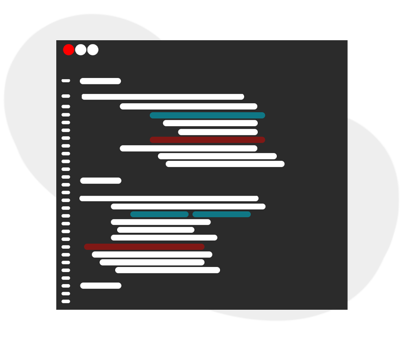
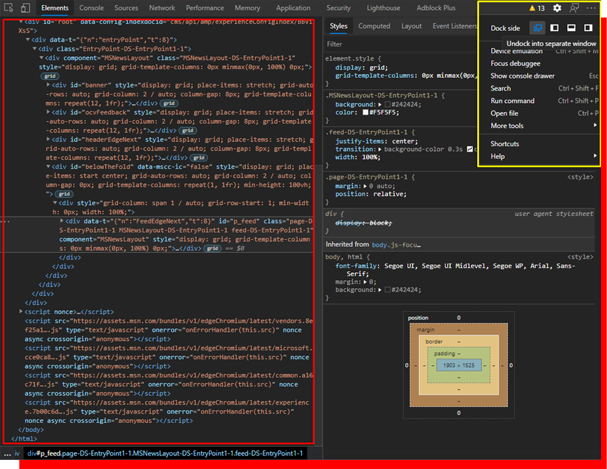

<h1 align="center"> 
  Ambiente de programação
</h1>

  
  
Editor de Texto ou <b>IDE</b> são frequentemente equipados com pacotes de desenvolvimento de software.

Como vamos tratar do JavaScript será necessário o uso de uma IDE para que possa desenvolver seus códigos, porém não será necessário nada complexo, caso tenha alguma preferência em Editor de Texto ou mesmo uma IDE, sinta-se a vontade.

Caso não tenha preferência e não saiba qual escolher, sugiro o Visual Studio Code (VSC)

[Link para Download](https://code.visualstudio.com/)

Como o JavaScript é uma linguagem de <i>script</i> para WEB, podemos usar o próprio navegador para ver os resultados de nossos códigos:

<ol>
  <li> Abra seu navegador.</li>

(recomendado uso do *Google Chrome* ou *Microsoft Edge*, por conta de sempre atualizarem rapidamente o **ECMAScript**).

<li> Aperte F12.</li>
 
 - Ou clique com botão direito, na janela do navegador e clique em "**Inspecionar elemento**" ou use o **Ctrl+Shift+I** para abrir direto.

<li> Pressione os três pontinhos no canto superior direito.</li>

  

Observe o **retângulo amarelo** onde mostra as opções dadas ao pressionar os **três pontos** e selecione a opcão que separa para uma **nova janela**.

<li> Agora vá para a aba "Console"</li>

  - Ao entrar dentro da aba, clique com o **botão direito** em qualquer trecho da tela e selecione a opção "**clear console**" e "**clear console history**".

  

  
  
Nesta imagem você pode observar todos os passos 😀.

</ol>

