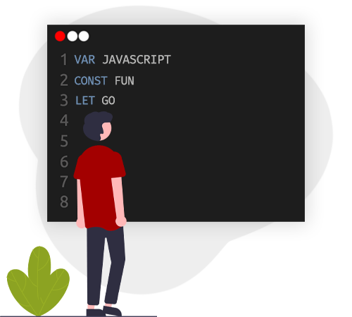
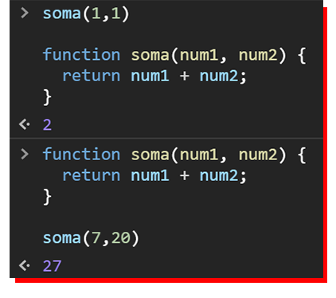
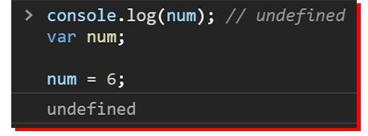
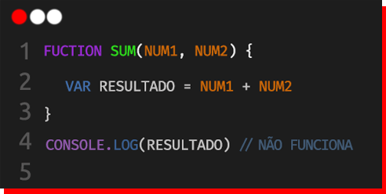
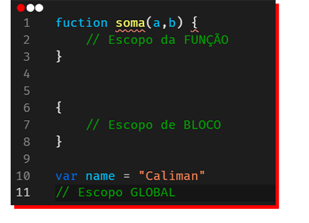
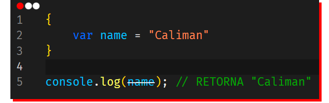
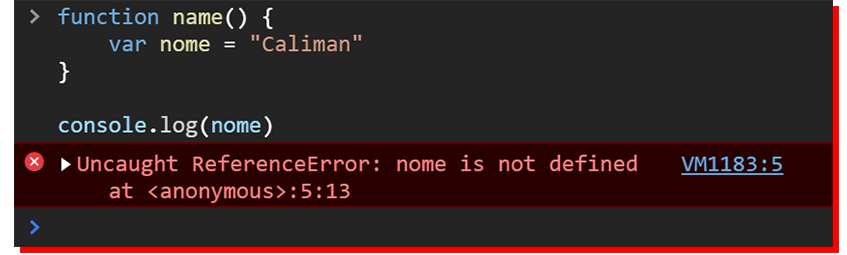
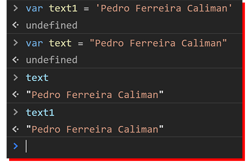

<h1 align="center"> 
  Variáveis em JavaScript
</h1>

<p align="center">
  
</p>
<p align="center"><strong>Declaração de Variável</strong></p>

Olá, vamos começar os estudos com a criação e manipulação de dados.

### 🌐 - Tipos de dados

<p><em>OBS: Os tipos são basicamente os tipos de valores que podemos manipular com a linguagem.</em>
  <ul>
    <li>String</li>
    <li>Number</li>
    <li>Boolean</li>
    <li>Object</li>
    <li>Array</li>
    <li>NULL</li>
    <li>Undefined</li>
  </ul>
  <i>~ Cada tópico será tratado abaixo, para que possa ficar tudo bem lúcido e fixo na sua cabeça</i> 😃.
</p>

### 0️⃣ - Declaração

Então há três formas de declarar uma nova variável, em seu código, elas são:

<ul>
    <li>Var</li>
    <li>Let</li>
    <li>Const</li>
</ul>

Para que possa usa-las vamos enteder suas diferenças primeiro 😎, mas ainda assim precisamos saber como funciona esses termos: Hoisting e Escopo em JavaScript.

<small>Para isso clique no cursor ao lado de "*Explicação de Conceitos*".</small>

<details>
  <summary>
    📃 - <b>Explicação de Conceitos</b>
  </summary>

##### *️⃣ - Hoisting

Uma das vantagens do JavaScript em colocar declarações de função na memória **antes mesmo de executar** qualquer parte do código, permitindo que você use uma função antes mesmo de declarar. 

> (_Como se a Linguagem levasse a declaração para cima_)

<p align="center">
  
</p>

> `fuction` - Declaração de uma função (será comentado melhor mais tarde 😃).
> `return` - Após termino da execução da função e especifica um valor a ser devolvido ao chamador de função.

Deve fixar que **somente** as declarações sáo hoisted(içadas, em português), por exemplo:

<p align="center">
  
</p>

> Observe que a atribuição não aparece `(num = 6)`, mas sim `undefined`, por somente ter declarado o espaço para alocar a variável.

##### *️⃣ - Escopo

A diferença entre eles é em relação ao escopo, na qual o <strong>escopo</strong> é acessibilidade de objetos, variáveis e funções em diferentes partes do código, de forma curta ele é quem determina quais são os dados que podem ser acessados em uma determinada parte do código.

<p align="center">
  
</p>

> `console.log` - Exibe uma mensagem no Console.

Para entendermos as secções do escopo, veja a imagem abaixo:

<p align="center">
  
  <figcaption><i>Observe as posições dos comentários</i></figcaption>
</p>


<ul>
  <li><b>Global</b></li>

  No escopo global, você pode acessar a variável em qualquer outro lugar do seu código 😱, como podemos ver a "`name`" é uma variável global tendo essa propriedade.

  Sendo uma característica única da declaração `var`.

<p align="center">
  
  <figcaption align="center"><i>A var em  <strong>escopo global</strong></i></figcaption>
</p>

<p align="center">
  
  <figcaption align="center">
    <i>Var sendo usada em <strong>escopo de função</strong></i>
  </figcaption>
</p>

Perceba que ao sair da função **não temos mais o acesso a variável**.

  <li><b>Função</b></li>


  <li><b>Bloco</b></li>


</ul>

</details> <!-- Conceitos -->

### 1️⃣ - Strings

O tipo `String` é usado para representar texto, mais especificamente uma Cadeia de caracteres.

Para declarar (usar o tipo) string podemos usar aspas simples(' ') ou aspas duplas/compostas (" "), assim tudo que estiver dentro das aspas vai ser considerado como texto.

```js
var num_text = '72' // Vai ser considerado um texto, não como um número
var text = "Pedro Ferreira Caliman" // Vai ser atribuído a cadeia de caracteres a variável text
```

<p align="center">
  
</p>

### ⚠ - Tipagem dinâmica

Uma característica do <em>JavaScript</em>, é ser uma linguagem dinâmica, ou seja, não necessita declarar o tipo de dado de uma variável antes de sua atribuição (<em>O tipo será automaticamente determinado</em>). Possibilitando você reatribuir um tipo a uma variável por exemplo.


