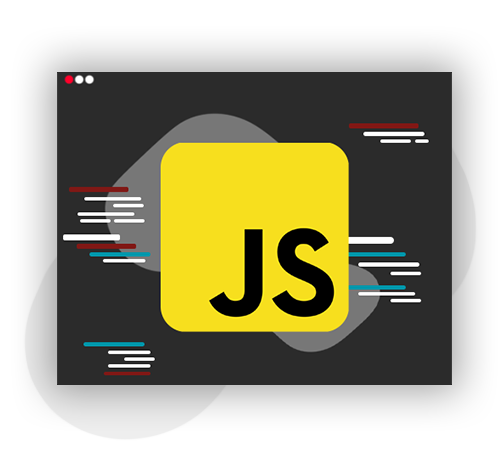

<h1 align="center"> 
	 JavaScript para Iniciantes
</h1>

  

  
Guia inicial de <strong>Javascript</strong> para iniciantes na linguagem.

  

    
  

## ℹ - Sobre o Repositório

  
Olá, jovem padawan! Como sabe Javascript é uma linguagem de programação que nos ajuda a executar nosso código através do navegador, Podendo lidar com quaisquer eventos entre o usuário e o site. Sendo uma das linguagens mais utilizadas e pesquisadas segundo o <a href="http://pt.stackoverflow.com/">StackOverflow</a>, Portanto esse Guia lhe permitirá que você viaje dentro desse mundo 🌎.

  
O repositório tem como finalidade de aprender e aprimorar o conhecimento na linguagem (JavaScript), tendo o público alvo os novos dev's. Dentro do repositório, haverá <strong>5 módulos</strong> (listados mais abaixo), explicando o básico da linguagem e contendo algumas propostas de exercícios (todos resolvidos, contidos dentro do próprio repositório). Tudo isso para que você possa colocar a mão na massa 😁.

  
Fico alegre que tenha chegado até este repositório e possamos nos aventurar junto nesse <strong>Grande Mundo de Possiblidade🌎</strong>

>_Como é usado o Github para a hospedagem do material, peço para que no caso de qualquer dúvida/correção ou sugestão de melhoria, que você cria um [**Issue**](https://github.com/kszinhu/JavaScript4Noobs/issues) neste mesmo repositório, sendo assim possível resolver essas questões dentro do nosso projeto._

#### 🔔 Status do Projeto

- [x] Em elaboração
- [ ] Concluído

## 📚 - Módulos

1. [Ambiente de programação](https://github.com/kszinhu/JavaScript4Noobs/blob/main/Ambiente/Ambiente.md)
>_IDE/Editor de Texto e configurações para programação em JS_
2. [Básico](https://github.com/kszinhu/JavaScript4Noobs/blob/main/básico/Basico.md)
>_Módulo com os recursos básicos da linguagem como: Tipos de várivel e Tratamentos de dados, Estruturas Condicionais e de Repetições_
3. [DOM (Document Object Model)](Url)
>_Contém explicação e alguns usos básicos do recurso_
4. [Avançando](Url)
>_Array,Object, modularização, RegEx, JSON, AJAX, NodeJS_

## 👨🏽‍💻 - Autores e Colaboradores

- **Cassiano Henrique Aparecido Rodrigues** - [Linkedin](https://www.linkedin.com/in/cassiano-rodrigues-28bb8b16a/)
- **Dhiego Cassiano Fogaça Barbosa** - [Linkedin](https://www.linkedin.com/in/modscleo4/)
